# 3章 機械学習と深層学習

## 11節 機械学習

|図|説明|
|----|----|
|[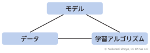](chatgpt-book-ch3-11-1-ml-triangle-structure.png)|機械学習を構成する3要素（モデル・データ・アルゴリズム）|
|[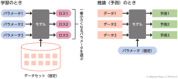](chatgpt-book-ch3-11-2-training-vs-inference.png)|機械学習の学習と推論（予測）の違い  |
|[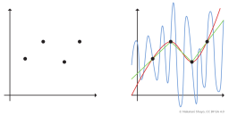](chatgpt-book-ch3-11-3-fitting-examples.png)|関数の推定と過学習の説明用|
|[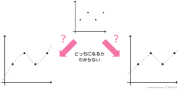](chatgpt-book-ch3-11-4-model-uncertainty.png)|限られたデータからデータ全体を知ることはできない（モデル選択のあいまいさ）|

## 12節 ニューラルネットワーク

|図|説明|
|----|----|
|[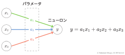](chatgpt-book-ch3-12-1-neuron-linear-combination.png)|ニューラルネットワークを構成するニューロン（線形結合）|
|[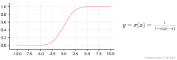](chatgpt-book-ch3-12-2-sigmoid-function-graph.png)|シグモイド関数のグラフと数式|
|[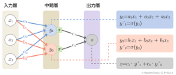](chatgpt-book-ch3-12-3-neural-network-structure.png)|ニューラルネットワークの構造と数式表現|

## 13節 ニューラルネットワークの学習

|図|説明|
|----|----|
|[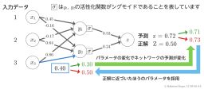](chatgpt-book-ch3-13-1-parameter-update-example.png)|ニューラルネットワークの出力の変化とパラメータの更新|
|[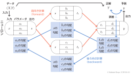](chatgpt-book-ch3-13-2-backpropagation-diagram.png)|ニューラルネットの順伝播と誤差逆伝播|

## 14節 正則化

|図|説明|
|----|----|
|[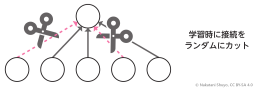](chatgpt-book-ch3-14-1-dropout-random-cut.png)|ドロップアウト|
|[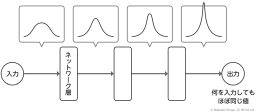](chatgpt-book-ch3-14-2-vanishing-gradient.png)|層を重ねると学習が進まない理由（勾配消失）|
|[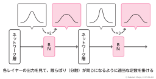](chatgpt-book-ch3-14-3-batch-normalization.png)|バッチ正規化（層ごとの出力分布を正規化）|
|[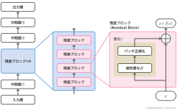](chatgpt-book-ch3-14-4-residual-block-structure.png)|ResNetの基本構成（残差ブロック）|

## 15節 コンピュータで数値を扱う方法

|図|説明|
|----|----|
|[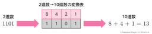](chatgpt-book-ch3-15-1-binary-to-decimal-int.png)|2進数による整数の表現|
|[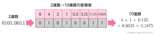](chatgpt-book-ch3-15-2-binary-to-decimal-float.png)|2進数による小数の表現（固定小数点数）|
||浮動小数点数の構造（仮数部と指数部）  |
|[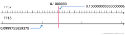](chatgpt-book-ch3-15-4-fp32-vs-fp16-precision.png)|FP32とFP16の精度の違い|

## 16節 量子化

|図|説明|
|----|----|
|[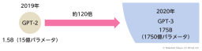](chatgpt-book-ch3-16-1-gpt2-to-gpt3-scaleup.png)|モデルパラメータの増加比較（2019年のGPT-2から2020年のGPT-3へ）  |
|[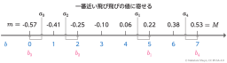](chatgpt-book-ch3-16-2-quantization-mechanism.png)|量子化（最も近い離散値への近似）|

## 17節 GPUを使った深層学習

|図|説明|
|----|----|
|[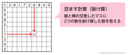](chatgpt-book-ch3-17-1-100-grid-calculation.png)|百ます計算（GPUの高速計算の原理の説明用）|
|[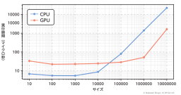](chatgpt-book-ch3-17-2-cpu-vs-gpu-speed.png)|CPUとGPUの処理時間比較（両対数グラフ）|
