# 4章 自然言語処理

## 18節 自然言語処理

|図|説明|
|----|----|
|[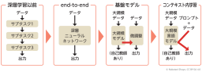](chatgpt-book-ch4-18-1-nlp-approach-stages.png)|自然言語処理のアプローチの変遷|

## 19節 文字と文字コード

|図|説明|
|----|----|
|[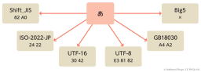](chatgpt-book-ch4-19-1-char-encoding.png)|文字コードごとのコンピュータ上の表現（バイト列）の違い|
|[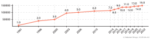](chatgpt-book-ch4-19-2-unicode-count-flow.png)|Unicodeの収録文字数の推移|

## 20節 単語とトークン

|図|説明|
|----|----|
|[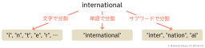](chatgpt-book-ch4-20-1-text-splitting-types.png)|文字・単語・サブワードへの分割例|
|[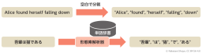](chatgpt-book-ch4-20-2-tokenization-en-ja.png)|英語と日本語の単語分割の違い|
||文字・単語による分割方式の課題|
|[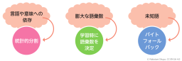](chatgpt-book-ch4-20-4-subword-tokenization-solutions.png)|サブワード分割による解決アプローチ|

## 21節 トークナイザー

|図|説明|
|----|----|
|[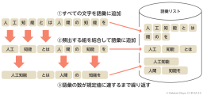](chatgpt-book-ch4-21-1-bpe-vocab-construction.png)|BPEトークナイザーの学習（語彙構築）|

## 22節 Word2Vec

|図|説明|
|----|----|
|[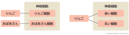](chatgpt-book-ch4-22-1-neural-representation-hypothesis.png)|おばあさん細胞仮説と分散表現仮説|
|[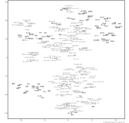](chatgpt-book-ch4-22-2-word2vec-embedding.png)|Word2Vecによる単語分布図|
|[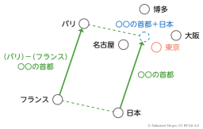](chatgpt-book-ch4-22-3-compositional-word2vec-embedding.png)|Word2Vecの加法構成性の例（280語の食べ物単語に対し、chiVeの埋め込みベクトルを2次元で可視化）|
|[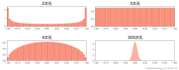](chatgpt-book-ch4-22-4-cos-sim-distribution-by-dimension.png)|ランダムベクトルのコサイン類似度の分布（2・3・4・300次元）|

## 23節 埋め込みベクトル

|図|説明|
|----|----|
|[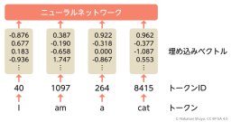](chatgpt-book-ch4-23-1-text-embedding-flow.png)|テキストをニューラルネットワークに入力する（トークン列→ベクトル列）|
|[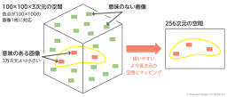](chatgpt-book-ch4-23-2-sub-variety-embedding.png)|ベクトル空間への埋め込み（構造を持った部分へのマッピング）|
|[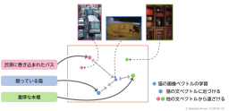](chatgpt-book-ch4-23-3-contrastive-learning-text-image.png)|ベクトル空間へのテキストと画像の埋め込み（マルチモーダル・対照学習）|

