# 5章 大規模言語モデル

## 24節 言語モデル

- 図はありません

## 25節 大規模言語モデル

|図|説明|
|----|----|
|[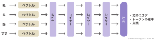](chatgpt-book-ch5-25-1-neural-language-model.png)|ニューラル言語モデル（トークンから出力までの流れ）|

## 26節 ニューラルネットワークの汎用性と基盤モデル

|図|説明|
|----|----|
|[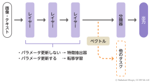](chatgpt-book-ch5-26-1-feature-extraction-and-transfer.png)|ニューラルネットワークにおける特徴抽出と転移学習|
|[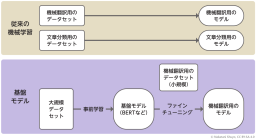](chatgpt-book-ch5-26-2-traditional-vs-foundation-ml.png)|BERT以前（従来型）とBERT以後（基盤モデル）の違い|

## 27節 スケーリング則と創発性

|図|説明|
|----|----|
|[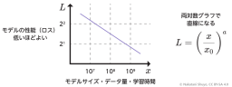](chatgpt-book-ch5-27-1-scaling-law-plot.png)|スケーリング則による性能向上の法則|
|[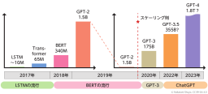](chatgpt-book-ch5-27-2-language-model-growth-timeline.png)|言語モデルのサイズ変遷|

## 28節 言語モデルによるテキスト生成の仕組み

|図|説明|
|----|----|
|[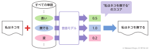](chatgpt-book-ch5-28-1-token-prediction.png)|言語モデルによる次の単語を予測する仕組み|
|[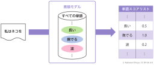](chatgpt-book-ch5-28-2-word-score-list-output.png)|文生成が得意な言語モデル（次単語のスコアリストを予測）|
|[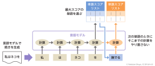](chatgpt-book-ch5-28-3-causal-lm-token-prediction.png)|自己回帰言語モデルにおける次単語予測|
|[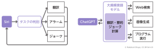](chatgpt-book-ch5-28-4-siri-vs-chatgpt-architecture.png)|SiriとChatGPTの仕組みの違い|

## 29節 テキスト生成の戦略

|図|説明|
|----|----|
|[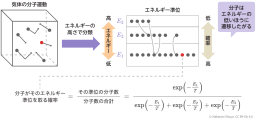](chatgpt-book-ch5-29-1-energy-distribution-stats.png)|熱統計力学におけるエネルギー準位と確率の関係|
|[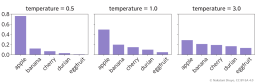](chatgpt-book-ch5-29-2-softmax-temperature-effect.png)|温度パラメータによる単語確率分布の違い|
|[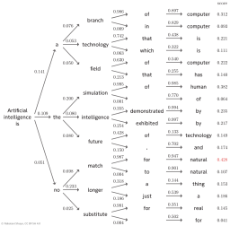](chatgpt-book-ch5-29-3-sentence-generation-graph.png)|"Artificial intelligence is" に続く単語の樹形図|
|[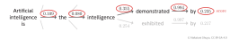](chatgpt-book-ch5-29-4-part-of-generation-graph.png)|前図（単語の樹形図）の一部|
|[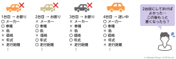](chatgpt-book-ch5-29-5-marriage-problem-for-car.png)|結婚問題（中古車の場合）|

## 30節 言語モデルによるAIチャット

|図|説明|
|----|----|
|[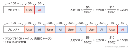](chatgpt-book-ch5-30-1-chat-turns-and-pricing.png)|発話回数による料金の増加イメージ（会話が長くなるとAIの発言費用が高くなる）|

## 31節 ローカルLLM

|図|説明|
|----|----|
|[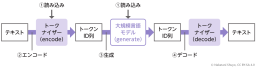](chatgpt-book-ch5-31-1-llm-inference-process.png)|ローカルLLMの推論プロセス|

## 32節 大規模言語モデルのライセンス

- 図はありません

## 33節 大規模言語モデルの評価

- 図はありません

## 34節 大規模言語モデルの学習〜事前学習〜

|図|説明|
|----|----|
|[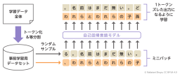](chatgpt-book-ch5-34-1-autoregressive-pretraining.png)|自己回帰型言語モデルの事前学習手順|

## 35節 大規模言語モデルの学習〜ファインチューニング〜

|図|説明|
|----|----|
|[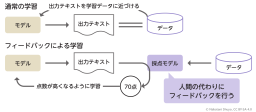](chatgpt-book-ch5-35-1-supervised-vs-rlhf.png)|強化学習（RLHF）：フィードバックによる学習|
|[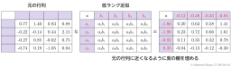](chatgpt-book-ch5-35-2-low-rank-matrix-approximation.png)|行列の低ランク近似|
|[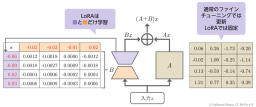](chatgpt-book-ch5-35-3-lora-training-mechanism.png)|LoRAの仕組みと更新されるパラメータ|
|[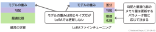](chatgpt-book-ch5-35-4-lora-vs-standard-training.png)|LoRAと通常学習の使用メモリ比較|

## 36節 コンテキスト内学習

- 図はありません
