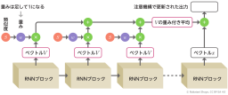
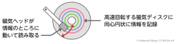

# 6章 トランスフォーマー

## 37節 回帰型ニューラルネットワーク

|図|説明|
|----|----|
||画像をベクトルに変換|
||パディングして可変長の入力に対応（文長の統一）|
||RNNの基本公正（逐次処理の構造）|
||RNNの構成例（多層RNNと双方向RNNの比較）|
||言語モデルとしてのRNN（文章生成の流れ）|
||本当は深いRNN（トークンの処理深度の可視化）|
||LSTMの基本構成（RNNとLSTMの比較）|
||RNNによるエンコーダー・デコーダー（翻訳タスクを例に）|

## 38節 注意機構（Attention）

|図|説明|
|----|----|
||Memory Networkのモデル概要（シンプルなAttentionによる質問応答の仕組み）|
||RNNによるエンコーダー・デコーダー（Attentionを組み込む前）|
||RNNエンコーダー・デコーダーと注意機構|

## 39節 注意機構の計算

|図|説明|
|----|----|
||RNNブロックから検索キーK、値V、質問Qを生成|
||検索キーKと質問Qの類似度計算|
||値VのAttention重み付き平均と元のブロックの出力の和を取る|
||注意機構の学習|

## 40節 トランスフォーマー（Transformer）

|図|説明|
|----|----|
||LSTM（RNN）とTransformerの基本構成を比較|
||シンプルなTransformerブロックの構成|
||位置エンコーディング（絶対位置）の加算|
||HDD（ハードディスク）の読み取りヘッド（マルチ「ヘッド」の用語の説明として）|
||マルチヘッドAttentionの動作|

## 41節 BERT

|図|説明|
|----|----|
||BERTによる基盤モデルの事前学習とファインチューニング|
||BERTの事前学習（Masked言語モデル）|
||BERTの事前学習（次文章予測）|

## 42節 GPT（Generative Pretrained Transformer）

|図|説明|
|----|----|
||GPT（Generative Pretrained Transformer）の基本構成|
||Mixture of Expertsの模式図|

