# 7章 APIを使ったAI開発

## 43節 OpenAI APIの利用

- 図はありません

## 44節 テキスト生成API（Completion API）

|図|説明|
|----|----|
||Completion APIによる文章生成|
||ChatCompletion APIによる質問応答|
|[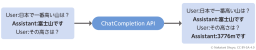](chatgpt-book-ch7-44-3-chatcompletion-api-dialogue.png)|ChatCompletion APIによる対話|

## 45節 OpenAI APIの料金

- 図はありません

## 46節 テキスト生成APIに指定するパラメータ

|図|説明|
|----|----|
|[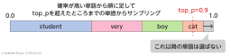](chatgpt-book-ch7-46-1-top-p-sampling-process.png)|top-pサンプリングの仕組み|
|[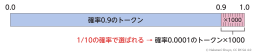](chatgpt-book-ch7-46-2-long-tail-token-sampling.png)|ロングテール（大量の低確率）トークンのサンプリングとtop_pの目的|

## 47節 テキスト生成APIと外部ツールの連携～Function Calling

|図|説明|
|----|----|
|[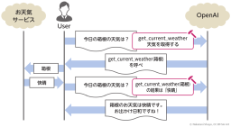](chatgpt-book-ch7-47-1-function-calling-example-sequence.png)|Function Callingを使った外部ツールとLLMの連携|
|[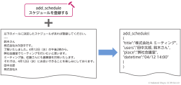](chatgpt-book-ch7-47-2-function-calling-extraction.png)|Function Callingを使って自然文から機械可読な情報を取り出す（例：メールからスケジュール情報の抽出）|

## 48節 埋め込みベクトル生成APIと規約違反チェックAPI

|図|説明|
|----|----|
|[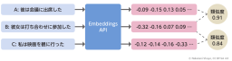](chatgpt-book-ch7-48-1-embeddings-api-similarity.png)|Embeddings APIによる埋め込みベクトル生成と類似度計算|
|[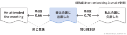](chatgpt-book-ch7-48-2-embedding-cross-language-similarity.png)|同じ意味の英語より、別の意味の日本語のほうが類似度が高いこともある|

## 49節 OpenAI以外の大規模言語モデルAPIサービス

- 図はありません

## 50節 Retrieval Augmented Generation（RAG）

|図|説明|
|----|----|
|[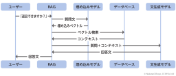](chatgpt-book-ch7-50-1-rag-sequence-flow.png)|シンプルなRAGの処理フロー|
|[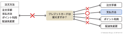](chatgpt-book-ch7-50-2-text-chunk-matching.png)|テキストを部品（チャンク）に分割することで適切にベクトル検索できる|
|[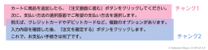](chatgpt-book-ch7-50-3-text-chunking-with-overlap.png)|テキストチャンク分割のイメージ（重複あり）|
|[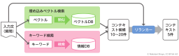](chatgpt-book-ch7-50-4-retrieval-and-reranking.png)|RAGにおける情報取得取りランクの流れ|
